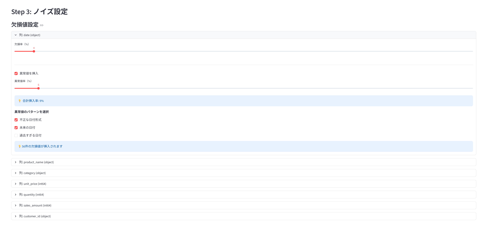
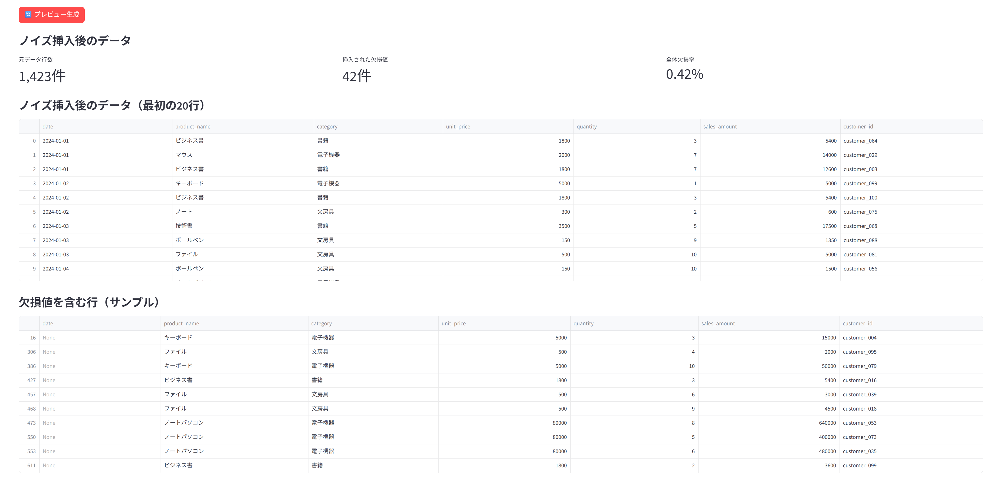

# Data Noise Generator - 要件定義書

## 1. プロジェクト概要

### 1.1 プロジェクト名
**Data Noise Generator**

### 1.2 目的
データ前処理やデータクリーニングのテスト用に、任意のCSVファイルに対して欠損値や異常値を意図的に挿入するツールを開発する。初心者データサイエンティストでも直感的に使用できるGUIベースのアプリケーションを提供することで、テストデータ作成の効率化を図る。

### 1.3 想定ユーザー
- データサイエンティスト(初級〜中級)
- データアナリスト
- データエンジニア
- 機械学習エンジニア
- データ前処理の学習者

### 1.4 期待される効果
- テストデータ作成時間の短縮
- データ前処理ロジックの動作検証が容易に
- 機械学習モデルのロバスト性検証が可能に
- データ品質管理の学習教材として活用可能

---

## 2. 機能要件

### 2.1 主要機能

#### 2.1.1 CSVファイルアップロード機能
- **説明**: ユーザーがローカルのCSVファイルをアップロード
- **制約**: 
  - 対応形式: CSV(UTF-8, Shift-JIS)
  - 最大ファイルサイズ: 200MB
- **エラーハンドリング**:
  - CSV以外の形式 → エラーメッセージ表示
  - 空ファイル → エラーメッセージ表示
  - 列が存在しない → エラーメッセージ表示

#### 2.1.2 データプレビュー機能
- **説明**: アップロードされたCSVの内容を表示
- **表示内容**:
  - 最初の10行
  - 各列のデータ型(自動判定)
  - 行数・列数の情報

#### 2.1.3 データ型自動判定機能
- **説明**: 各列のデータ型を自動判定
- **判定ルール**:
  - 数値型: int, float
  - 日付型: datetime形式(pandas自動判定)
  - 文字列型: object
- **ユーザー操作**: 必要に応じて手動で型を変更可能

#### 2.1.4 欠損値挿入機能
- **説明**: 指定した列に対して欠損値(NaN)を挿入
- **設定項目**:
  - 対象列: 列ごとに個別設定
  - 欠損率: 0〜100%(スライダー入力)
- **挿入方法**: ランダムに指定%の行を欠損値に変換
- **制約**: 欠損率 + 異常値率 ≤ 100%

#### 2.1.5 異常値挿入機能
- **説明**: 指定した列に対してデータ型に応じた異常値を挿入
- **設定項目**:
  - 対象列: 列ごとに個別設定
  - 異常値率: 0〜100%(スライダー入力)
  - 異常値の種類: チェックボックスで複数選択可能

##### 数値型列の異常値パターン
- マイナスの数値(通常プラスの場合)
- 平均の10倍の値
- 0(ゼロ)
- 型違い(文字列を挿入)

##### 文字列型列の異常値パターン
- 数値を挿入
- 想定外の文字列(カスタム入力可能)
  - 例: 支店名列に存在しない支店名を挿入

##### 日付型列の異常値パターン
- 不正な日付形式(例: "2024-13-45")
- 未来の日付
- 過去すぎる日付(例: "1900-01-01")
- 型違い(文字列や数値を挿入)

##### 異常値の配分ルール
- 挿入数 = 全件数 × 異常値率
- 選択された異常値パターンをできる限り均等に配分
- 各パターン最低1個以上保証
- 端数はランダムに割り当て

**配分例**: 
- 全件数: 100件
- 異常値率: 10%(10件)
- 選択パターン: 3種類
- 配分: 種類A(4件)、種類B(3件)、種類C(3件)

#### 2.1.6 プレビュー機能
- **説明**: ノイズ挿入後のデータを生成前にプレビュー表示
- **表示形式**:
  - 最初の20行を表示
  - 欠損値: 赤色で強調表示
  - 異常値: 黄色で強調表示
- **操作**: 設定を調整して再プレビュー可能

#### 2.1.7 CSVダウンロード機能
- **説明**: ノイズを挿入したCSVファイルをダウンロード
- **ファイル名規則**: `{元ファイル名}_noisy.csv`
  - 例: `sales_data.csv` → `sales_data_noisy.csv`
- **エンコーディング**: UTF-8

---

### 2.2 非機能要件

#### 2.2.1 パフォーマンス
- 10万行程度のCSVファイルでも10秒以内に処理完了
- UIの応答速度: 操作後1秒以内にフィードバック表示

#### 2.2.2 ユーザビリティ
- 直感的な操作: 説明なしで使用方法が理解できるUI
- エラーメッセージ: 分かりやすい日本語で原因と対処法を表示
- レスポンシブ対応: ブラウザサイズに応じたレイアウト調整

#### 2.2.3 保守性
- コードの可読性: 関数・クラス単位でモジュール化
- ドキュメント: README、関数docstring完備
- 拡張性: 新しい異常値パターンを容易に追加可能な設計

---

## 3. システム構成

### 3.1 技術スタック
- **言語**: Python 3.12
- **フレームワーク**: Streamlit
- **ライブラリ**:
  - pandas: データ処理
  - numpy: 乱数生成・数値計算
  - streamlit: GUI構築

### 3.2 ファイル構成
```
data-noise-generator/
├── app.py                  # メインアプリケーション
├── utils/
│   ├── __init__.py
│   ├── data_loader.py      # CSV読込・検証
│   ├── noise_generator.py  # ノイズ生成ロジック
│   └── validator.py        # バリデーション
├── config/
│   └── noise_patterns.py   # 異常値パターン定義
├── requirements.txt        # 依存ライブラリ
└── README.md               # 使い方ドキュメント
※テストコードの作成は将来的に実装予定 
```

---

## 4. UI設計

### 4.1 画面レイアウト
```
┌─────────────────────────────────────────────┐
│  📊 Data Noise Generator                    │
├─────────────────────────────────────────────┤
│                                             │
│  Step 1: CSVファイルをアップロード            │
│  ┌─────────────────────────────┐            │
│  │ 📁 [Browse files...]        │            │
│  └─────────────────────────────┘            │
│                                             │
│  Step 2: 元データプレビュー                  │
│  ┌─────────────────────────────┐            │
│  │ [データ型自動判定結果]       │            │
│  │ date(日付型) | amount(数値) │            │
│  │ 2024-01-01   | 1000         │            │
│  │ ...                         │            │
│  └─────────────────────────────┘            │
│                                             │
│  Step 3: ノイズ設定                         │
│  ┌─────────────────────────────────────┐   │
│  │ 列: date (日付型)                     │   │
│  │ 欠損率: [=========>      ] 30%        │   │
│  │ ☑ 異常値を挿入 (10%)                  │   │
│  │   ☑ 不正な日付形式                    │   │
│  │   ☐ 未来の日付                        │   │
│  ├─────────────────────────────────────┤   │
│  │ 列: amount (数値型)                   │   │
│  │ 欠損率: [=====>           ] 15%       │   │
│  │ ☑ 異常値を挿入 (5%)                   │   │
│  │   ☑ マイナスの数値                    │   │
│  │   ☑ 平均の10倍                        │   │
│  │   ☐ 0(ゼロ)                           │   │
│  └─────────────────────────────────────┘   │
│                                             │
│  ⚠ 合計挿入率: 60% (欠損45% + 異常15%)      │
│                                             │
│  Step 4: プレビュー                         │
│  [🔄 Generate Preview] ボタン               │
│  ┌─────────────────────────────┐            │
│  │ date       | amount | name  │            │
│  │ 🔴 NaN     | 1000   | Alice │            │
│  │ 2024-01-01 | 🟡-500 | Bob   │            │
│  │ ...                         │            │
│  └─────────────────────────────┘            │
│                                             │
│  Step 5: ダウンロード                       │
│  📥 [Download Noisy CSV]                   │
│                                             │
└─────────────────────────────────────────────┘
```

---

## 5. エラーハンドリング

### 5.1 入力検証

| エラー内容 | 検証タイミング | エラーメッセージ | 対処法 |
|:---------|:-------------|:---------------|:------|
| CSV以外のファイル | ファイル選択時 | CSVファイルのみ選択可能 | - |
| 空ファイル | アップロード時 | ファイルが空です | データが含まれるCSVを選択 |
| 列が存在しない | アップロード時 | CSVファイルに列が存在しません | 正しい形式のCSVを選択 |
| 欠損率+異常値率>100% | 設定変更時 | 合計挿入率が100%を超えています。設定を調整してください | スライダーで値を調整 |
| 異常値パターン未選択 | プレビュー時 | 異常値を挿入する場合は、パターンを1つ以上選択してください | チェックボックスを選択 |

### 5.2 処理エラー

| エラー内容 | 対処法 |
|:---------|:------|
| メモリ不足 | ファイルサイズが大きすぎます。200MB以下のファイルを使用してください |
| 処理タイムアウト | 処理に時間がかかっています。ファイルサイズを小さくしてください |
| 予期しないエラー | エラーが発生しました: {エラー詳細} |

---

## 6. 開発スケジュール

### 6.1 作業見積もり

| 項目 | 作業内容 | 見積時間 |
|:----|:--------|:--------|
| 環境構築 | プロジェクト作成・依存関係設定 | 0.5h |
| UI実装 | Streamlitレイアウト構築 | 1.5h |
| データ読込 | CSVアップロード・型判定 | 0.5h |
| 欠損値生成 | 欠損値挿入ロジック | 0.5h |
| 異常値生成 | 異常値挿入ロジック | 1.5h |
| プレビュー | ノイズ可視化機能 | 0.5h |
| ダウンロード | CSV出力機能 | 0.5h |
| エラーハンドリング | 入力検証・例外処理 | 0.5h |
| テスト | 単体テスト・結合テスト | 1h |
| ドキュメント | README・コメント整備 | 0.5h |
| **合計** | | **7h** |

### 6.2 開発フェーズ

#### Phase 1: MVP実装(5h)
- 基本UI
- 欠損値挿入機能
- ダウンロード機能

#### Phase 2: 異常値機能追加(2h)
- 異常値パターン実装
- プレビュー機能

#### Phase 3: 仕上げ(1h)
- エラーハンドリング強化
- README作成
- テスト

---

## 7. 今後の拡張案

### 7.1 将来的な機能追加候補
- 設定ファイルのエクスポート/インポート(YAML形式)
- 異常値パターンのカスタマイズ機能
- 複数CSVファイルの一括処理
- 生成前後の統計量比較表示
- Excel形式(.xlsx)のサポート
- 英語版UI対応

### 7.2 パフォーマンス改善
- 大容量ファイル(100万行以上)への対応
- 並列処理によるノイズ生成の高速化

---

## 8. 参考資料

### 8.1 関連技術
- Streamlit公式ドキュメント: https://docs.streamlit.io/
- pandas公式ドキュメント: https://pandas.pydata.org/docs/

### 8.2 類似ツール
- (調査中)

---

## 使い方

### 1. アプリケーションの起動
```bash
# プロジェクトディレクトリに移動
cd data-noise-generator

# 仮想環境を有効化
venv\Scripts\activate  # Windows
source venv/bin/activate  # Mac/Linux

# アプリケーションを起動
streamlit run app.py
```

ブラウザが自動で開き、アプリケーションが表示されます。

---

### 2. CSVファイルのアップロード

1. 「CSVファイルを選択してください」ボタンをクリック
2. 任意のCSVファイルを選択(CSV形式のみ選択可能)
3. データプレビューが表示されます

---

### 3. ノイズ設定

各列の設定エリアを開いて、以下を設定します:

#### 欠損値の設定
- **欠損率スライダー**: 0〜100%で欠損値の割合を指定

#### 異常値の設定
1. 「異常値を挿入」にチェック
2. **異常値率スライダー**: 0〜100%で異常値の割合を指定
3. **異常値のパターンを選択**:
   - **数値型の列**:
     - マイナスの数値
     - 平均の10倍
     - 0(ゼロ)
     - 文字列を挿入
   - **文字列型の列**:
     - 数値を挿入
     - 想定外の文字列(カスタム入力可能)
   - **日付型の列**:
     - 不正な日付形式
     - 未来の日付
     - 過去すぎる日付

**注意**: 欠損率 + 異常値率は100%以下にしてください

---

### 4. プレビュー生成

1. 「🔄 プレビュー生成」ボタンをクリック
2. ノイズ挿入後のデータがプレビュー表示されます
3. 以下の情報が確認できます:
   - 元データ行数
   - 挿入された欠損値の件数
   - 全体欠損率
   - プレビュー(最初の20行)
   - 欠損値を含む行(サンプル10行)
   - 列ごとの欠損率

---

### 5. CSVダウンロード

「📥 ノイズ入りCSVをダウンロード」ボタンをクリックすると、  
`元ファイル名_noisy.csv` という名前でダウンロードされます。

---

## 使用例

### ケース1: 欠損値のみを挿入

1. date列の欠損率を10%に設定
2. amount列の欠損率を5%に設定
3. プレビュー生成 → ダウンロード

### ケース2: 異常値のみを挿入

1. unit_price列で異常値を有効化
2. 異常値率を10%に設定
3. パターン「マイナスの数値」「0(ゼロ)」を選択
4. プレビュー生成 → ダウンロード

### ケース3: 欠損値と異常値を組み合わせ

1. date列: 欠損率10% + 異常値率5%(不正な日付形式)
2. amount列: 欠損率5% + 異常値率10%(マイナス、平均の10倍)
3. プレビュー生成 → ダウンロード

---

## スクリーンショット

### 初期画面


### ノイズ設定画面


### プレビュー画面

---


## 9. 承認

### 9.1 要件定義承認

| 役割 | 氏名 | 承認日 | 署名 |
|:----|:----|:------|:----|
| 開発者 | t.ozawa_free | 2025/01/26 | |

---

**文書バージョン**: v1.0  
**最終更新日**: 2025年1月26日  
**作成者**: t.ozawa_free